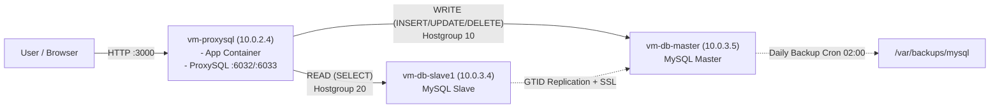

# DevOps Mini Project 2 — E-Commerce DB HA (Terraform + Ansible)

Proyek ini merancang ulang arsitektur basis data e-commerce agar memiliki **high availability**, **read/write splitting** via ProxySQL, serta memenuhi standar keamanan melalui **enkripsi**, **firewalling**, dan **otomatisasi backup**.

**Kelompok: 8**   
**Anggota Kelompok:** 
| No | Nama | NRP |
| :--- | :---- | :--- |
| 1 | Maulana Ahmad Zahiri | 5027231010 |
| 2 | Furqon Aryadana | 5027231024 |
| 3 | Dionisius Marcell Putra | 5027231044 |
| 4 | Muhammad Hildan Adiwena | 5027231077 |
| 5 | Abid Ubaidillah A. | 5027231089 |
| 6 | Salomo | 5027221063 |

---
   
## Studi Kasus
**Latar Belakang:** Sebuah perusahaan e-commerce menghadapi masalah kinerja dan skalabilitas pada basis data transaksionalnya yang saat ini berjalan pada satu instance. Selain itu, kurangnya enkripsi data in transit dan tidak adanya prosedur backup otomatis telah meningkatkan risiko keamanan data dan potensi downtime yang berkepanjangan. Anda, sebagai Lead DevOps Engineer, ditugaskan untuk merancang ulang arsitektur basis data agar memiliki high availability, mampu melakukan read/write splitting secara efisien, serta memenuhi standar keamanan industri melalui enkripsi, firewalling, dan otomatisasi pemulihan data.

**Tujuan:** Mahasiswa diharapkan memiliki kompetensi dalam merancang dan mengimplementasikan arsitektur basis data relasional secara highly available, mengamankan komunikasi data menggunakan SSL, mengotomatisasi manajemen akses dan backup, serta mengintegrasikan pemindaian keamanan kontainer dalam alur deployment.

Proyek ini mengimplementasikan arsitektur database e-commerce dengan:
- MySQL replication (master-slave)
- ProxySQL read/write split
- TLS in transit
- least-privilege DB users
- automated backup (cron)

## Catatan Arsitektur (Instruksi Pak Deka)

Spesifikasi awal studi kasus meminta:
- 1 ProxySQL
- 3 Database (1 master + 2 slave)
- 1 App node

Implementasi aktif di repo ini mengikuti instruksi Pak Deka untuk keterbatasan kuota Azure Student:
- 1 ProxySQL node
- 1 DB master
- 1 DB slave
- App service digabung di node ProxySQL

Total: 3 VM (proxy + master + slave).

## Struktur Proyek

```text
devops-miniproject2/
├── Dockerfile
├── src/
├── terraform/
├── ansible/
├── scripts/
│   └── docker-scout-scan.sh
└── README.md
```

## Gambar Arsitektur Implementasi (Aktif)



## Panduan Eksekusi Dari Nol Sampai Aplikasi Bisa Diakses

### 0) Clone repo

```bash
cd /Users/furqonaryadana/Downloads/DevopsETS
git clone <URL-REPO-KALIAN> devops-miniproject2
cd devops-miniproject2
```

### 1) Prasyarat tools lokal

```bash
terraform version
az version
ansible --version
docker --version
```

### 2) Login Azure + set subscription

```bash
az login
az account list -o table
az account set --subscription "<SUBSCRIPTION_ID_ATAU_NAMA>"
```

### 3) Provision infrastruktur (Terraform)

```bash
cd /Users/furqonaryadana/Downloads/DevopsETS/devops-miniproject2/terraform

export TF_VAR_resource_group_name="rg-ecommerce-furqon-$(date +%m%d%H%M%S)"
export TF_VAR_location="malaysiawest"
export TF_VAR_vm_size="Standard_B2s_v2"
export TF_VAR_enable_app_vm="false"

terraform init
terraform apply -auto-approve -parallelism=1
```

### 4) Konfigurasi service (Ansible)

```bash
cd /Users/furqonaryadana/Downloads/DevopsETS/devops-miniproject2/ansible
cp -n group_vars/all.yml.example group_vars/all.yml

# Opsi A: jika terraform output tersedia di device ini
./inventory/generate_inventory.sh ../terraform ./inventory/hosts.ini

# Opsi B: jika clone baru dan terraform output kosong
# ganti RG sesuai resource group aktif
RG="<RESOURCE_GROUP_NAME>"
./inventory/generate_inventory_from_azure.sh "$RG" ./inventory/hosts.ini

ansible all -i ./inventory/hosts.ini -m ping
ansible-playbook -i ./inventory/hosts.ini site.yml --limit 'localhost,db,proxy,app'
```

### 5) Cek aplikasi bisa diakses

```bash
# Cara aman tanpa terraform state lokal: ambil IP dari Azure
RG="<RESOURCE_GROUP_NAME>"
PROXY_IP=$(az network public-ip show -g "$RG" -n pip-proxy --query ipAddress -o tsv)

curl "http://$PROXY_IP:3000/health"
curl "http://$PROXY_IP:3000/api/products"
```

Jika `health` dan `products` sukses, berarti sistem sudah up end-to-end.

## Tahap 1 — Kontainerisasi + Docker Scout

### Build dan scan image

```bash
cd /Users/furqonaryadana/Downloads/DevopsETS/devops-miniproject2
./scripts/docker-scout-scan.sh
```

Script ini akan:
1. build `ecommerce-app:1.0.0`
2. scan `ecommerce-app:1.0.0` dengan Docker Scout
3. pull + scan `proxysql/proxysql:2.6.2`
4. menyimpan bukti scan ke:
   - `artifacts/security/scout-ecommerce-app.txt`
   - `artifacts/security/scout-proxysql.txt`
   - `artifacts/security/scout-summary.txt`

Bukti ini bisa dipakai untuk lampiran laporan/screenshot tahap Docker security scanning.

## Tahap 2 — Provisioning Azure dengan Terraform

### Prasyarat

- Terraform
- Azure CLI (`az login`)
- SSH key (`~/.ssh/id_rsa.pub`)

### Deploy (mode 3 VM sesuai Pak Deka)

```bash
cd /Users/furqonaryadana/Downloads/DevopsETS/devops-miniproject2/terraform

export TF_VAR_resource_group_name="rg-ecommerce-furqon-$(date +%m%d%H%M%S)"
export TF_VAR_location="malaysiawest"
export TF_VAR_vm_size="Standard_B2s_v2"
export TF_VAR_enable_app_vm="false"

terraform init
terraform apply -auto-approve -parallelism=1
terraform output
```

### Hasil yang diharapkan

- 1 VM proxy (`vm-proxysql`)
- 2 VM DB (`vm-db-master`, `vm-db-slave1`)
- VNet + subnet + NSG terisolasi
- Output IP publik/private dan SSH command

## Tahap 3 — Konfigurasi dengan Ansible

### Jalankan playbook

```bash
cd /Users/furqonaryadana/Downloads/DevopsETS/devops-miniproject2/ansible
./inventory/generate_inventory.sh ../terraform ./inventory/hosts.ini
cp -n group_vars/all.yml.example group_vars/all.yml
ansible all -m ping
ansible-playbook site.yml --limit localhost,db,proxy,app
```

Jika repo baru di-clone dan `terraform output` kosong (state tidak ada di device tersebut), gunakan generator inventory berbasis Azure:

```bash
./inventory/generate_inventory_from_azure.sh <resource-group-name> ./inventory/hosts.ini
```

### Yang dikonfigurasi otomatis

- common baseline package
- MySQL master/slave replication (GTID + SSL)
- ProxySQL read/write split
- app deployment via Docker
- backup script + cron pada master

## TLS Hardening

Default app sekarang memakai verifikasi sertifikat aktif:
- `DB_SSL_REJECT_UNAUTHORIZED=true`

Sertifikat server yang digenerate Ansible sudah ditambah SAN (termasuk `host.docker.internal` untuk node proxy) agar koneksi app -> ProxySQL tetap valid saat TLS verify aktif.

Jika environment lama masih memakai sertifikat lama, regenerate cert:

```bash
cd /Users/furqonaryadana/Downloads/DevopsETS/devops-miniproject2/ansible
rm -rf ./artifacts/certs
ansible-playbook site.yml --limit localhost,db,proxy,app
```

## Verifikasi Fungsional

```bash
cd /Users/furqonaryadana/Downloads/DevopsETS/devops-miniproject2/terraform
PROXY_IP=$(terraform output -raw proxy_public_ip)

curl "http://$PROXY_IP:3000/health"
curl "http://$PROXY_IP:3000/api/products"
curl -X POST "http://$PROXY_IP:3000/api/orders" \
  -H "Content-Type: application/json" \
  -d '{"product_id":1,"quantity":2,"customer_name":"Furqon"}'
curl "http://$PROXY_IP:3000/api/orders"
```

## Verifikasi ProxySQL Routing

```bash
PROXY_IP=$(terraform output -raw proxy_public_ip)
ssh azureuser@"$PROXY_IP" "sudo docker exec -i proxysql mysql -uadmin -padmin -h127.0.0.1 -P6032 --protocol=tcp -e 'SELECT hostgroup_id,hostname,status,use_ssl FROM runtime_mysql_servers; SELECT rule_id,match_pattern,destination_hostgroup FROM runtime_mysql_query_rules ORDER BY rule_id;'"
```

## Verifikasi Backup Otomatis

```bash
MASTER_IP=$(terraform output -json db_public_ips | jq -r .master)
ssh azureuser@"$MASTER_IP" "sudo /opt/mysql-backup/mysql-backup.sh && ls -lh /var/backups/mysql && sudo crontab -l | grep mysql-backup"
```

## Verifikasi Database & High Avaibility
### 1. Verifikasi Konektivitas & Replikasi (Data Integrity)
Membuktikan bahwa Master dan Slave tersinkronisasi sempurna secara real-time.
#### A. Buat Data di Master

```
ansible db_master -i ./inventory/hosts.ini -m shell -a "mysql -uroot -p'secretpassword' -e 'CREATE DATABASE db_verifikasi_ubaid; SHOW DATABASES;'" --become
```

#### B. Cek Data di Slave

```
ansible db_slave1 -i ./inventory/hosts.ini -m shell -a "mysql -uroot -p'secretpassword' -e 'SHOW DATABASES;'" --become
```

#### C. Audit Kesehatan Replikasi

```
ansible db_slave1 -i ./inventory/hosts.ini -m shell -a "mysql -uroot -p'secretpassword' -e 'SHOW SLAVE STATUS\G;'" --become
```

### 2. Verifikasi ProxySQL (Load Balancing)
Membuktikan bahwa ProxySQL mengenali kedua node database dan siap membagi beban kerja.
#### A. Cek Status Node di ProxySQL

```
RG="rg-ecommerce-ubaid-jakarta"
PROXY_IP=$(az network public-ip show -g "$RG" -n pip-proxy --query ipAddress -o tsv | tr -d '\r\n[:space:]')

ssh -t azureuser@"$PROXY_IP" "sudo docker exec -i proxysql mysql -uadmin -padmin -h127.0.0.1 -P6032 --protocol=tcp -e 'SELECT hostgroup_id, hostname, status, use_ssl FROM runtime_mysql_servers;'"
```

#### B. Cek Aturan Routing (Read/Write Split)

```
ssh -t azureuser@"$PROXY_IP" "sudo docker exec -i proxysql mysql -uadmin -padmin -h127.0.0.1 -P6032 --protocol=tcp -e 'SELECT rule_id, destination_hostgroup, match_pattern FROM runtime_mysql_query_rules;'"
```

### 3. Pembuktian Read/Write Splitting (Traffic Analysis)
Menunjukkan sistem bekerja secara dinamis.
#### A. Simulasi Trafik

```
curl "http://$PROXY_IP:3000/api/products"
```

#### B. Lihat Statistik Distribusi Query

```
ssh -t azureuser@"$PROXY_IP" "sudo docker exec -i proxysql mysql -uadmin -padmin -h127.0.0.1 -P6032 --protocol=tcp -e 'SELECT hostgroup, srv_host, Queries FROM stats.stats_mysql_connection_pool WHERE hostgroup IN (10,20);'"
```

## Audit SSL Database:
Menunjukkan bahwa koneksi antar database sudah aman.
```
ansible db -i ./inventory/hosts.ini -m shell -a "mysql -uroot -p'secretpassword' -e 'SHOW SESSION STATUS LIKE \"Ssl_cipher\";'" --become
```

## Mengulang kembali agar terminalnya bersih:

```
ansible db_master -i ./inventory/hosts.ini -m shell -a "mysql -uroot -p'secretpassword' -e 'DROP DATABASE db_verifikasi_ubaid;'" --become
```

## Panduan Video Demo (Maks. 15 Menit)

### Target isi video sesuai kebutuhan penilaian

1. Arsitektur berjalan (VM, subnet, role node).
2. Bukti Docker security scan (app + proxysql).
3. Bukti read/write splitting berjalan.
4. Bukti backup automation aktif.
5. Bukti aplikasi bisa diakses dari browser/API.

### Alur demo yang disarankan (timeline)

1. **Menit 0–2: Intro arsitektur**
   - Jelaskan 3 VM implementasi (sesuai instruksi Pak Deka).
   - Tunjukkan resource aktif:
   ```bash
   RG="<RESOURCE_GROUP_NAME>"
   az vm list -g "$RG" -d -o table
   ```
2. **Menit 2–4: Bukti Docker security scan**
   ```bash
   cd /Users/furqonaryadana/Downloads/DevopsETS/devops-miniproject2
   ./scripts/docker-scout-scan.sh
   ls -lh artifacts/security
   ```
   - Sorot ringkasan `HIGH/CRITICAL` dari:
   ```bash
   cat artifacts/security/scout-summary.txt
   ```
3. **Menit 4–8: Deploy/config proof (Terraform + Ansible)**
   - Tunjukkan `terraform` folder dan `ansible` folder.
   - Jalankan ping dan playbook (atau tunjukkan output sukses terakhir):
   ```bash
   cd ansible
   ansible all -i ./inventory/hosts.ini -m ping
   ansible-playbook -i ./inventory/hosts.ini site.yml --limit 'localhost,db,proxy,app'
   ```
4. **Menit 8–11: Bukti aplikasi + read/write split**
   ```bash
   RG="<RESOURCE_GROUP_NAME>"
   PROXY_IP=$(az network public-ip show -g "$RG" -n pip-proxy --query ipAddress -o tsv)

   curl "http://$PROXY_IP:3000/health"
   curl "http://$PROXY_IP:3000/api/products"
   curl -X POST "http://$PROXY_IP:3000/api/orders" -H "Content-Type: application/json" -d '{"product_id":1,"quantity":1,"customer_name":"Demo"}'
   curl "http://$PROXY_IP:3000/api/orders"
   ```
   - Bukti query terbagi ke hostgroup reader/writer:
   ```bash
   ssh azureuser@"$PROXY_IP" "sudo docker exec -i proxysql mysql -uadmin -padmin -h127.0.0.1 -P6032 --protocol=tcp -e 'SELECT hostgroup,srv_host,status,Queries FROM stats.stats_mysql_connection_pool WHERE hostgroup IN (10,20); SELECT hostgroup,digest_text,count_star FROM stats.stats_mysql_query_digest ORDER BY count_star DESC LIMIT 10;'"
   ```
5. **Menit 11–13: Bukti backup automation**
   ```bash
   MASTER_IP=$(az network public-ip show -g "$RG" -n pip-vm-db-master --query ipAddress -o tsv)
   ssh azureuser@"$MASTER_IP" "sudo /opt/mysql-backup/mysql-backup.sh && ls -lh /var/backups/mysql && sudo crontab -l | grep mysql-backup"
   ```
6. **Menit 13–15: Penutup**
   - Ringkas hasil: HA, TLS, split traffic, backup, security scan.
   - Sampaikan keterbatasan Azure Student dan alasan arsitektur 3 VM.

## Cleanup

```bash
cd /Users/furqonaryadana/Downloads/DevopsETS/devops-miniproject2/terraform
terraform destroy -auto-approve
```
